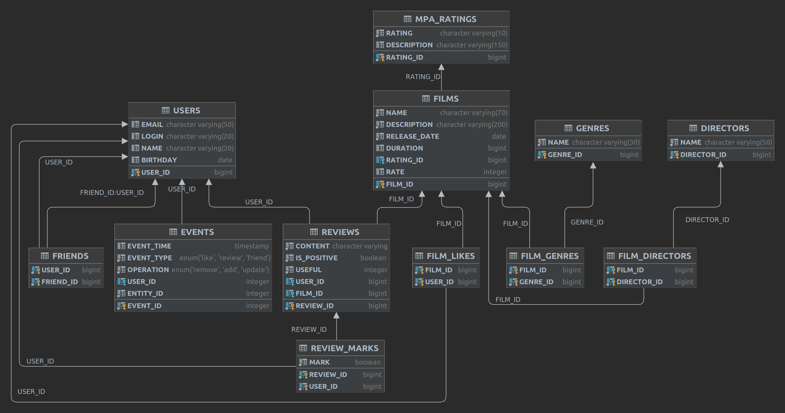

# java-filmorate
`Сервис поиска фильмов для просмотра`

### Схемы базы данных


#### Пример запроса - получить все фильмы
```SQL
select *
from films
```
#### Пример запроса - получить топ 10 наиболее популярных фильмов
```SQL    
select f.name
from film_likes l
join films f on f.film_id = l.film_id
group by l.film_id
order by count(l.user_id) desc
limit 10 
```
#### Пример запроса - получить всех пользователей
```SQL
select *
from users
```
#### Пример запроса - список общих друзей с другим пользователем
```SQL
--Имея id двух пользователей: USERID и OTHERID

select u.* from friends f
left join users u on f.friend_id = u.user_id
where f.user_id = USERID
	and f.friend_id in (
		select f.friend_id
		from friends f
		where f.user_id = OTHERID)
```